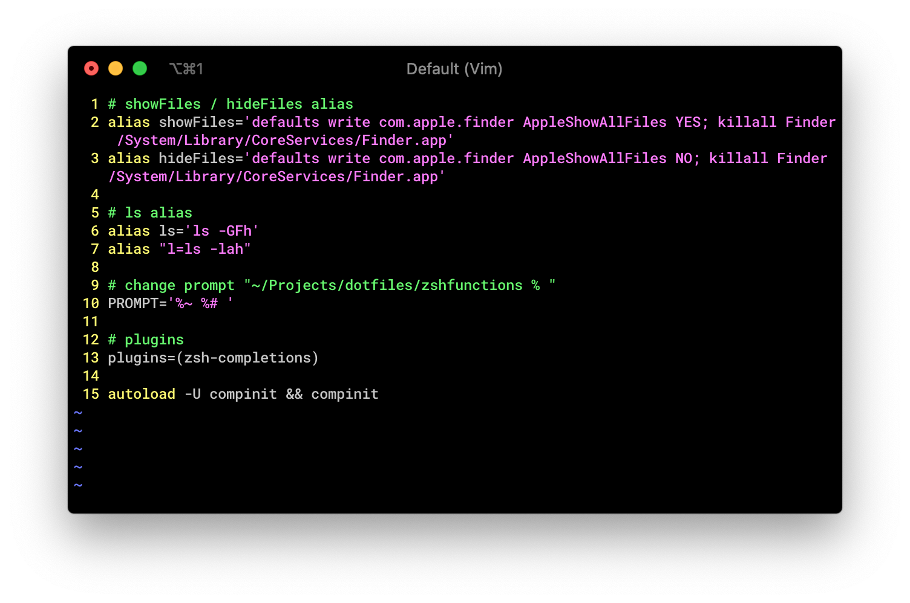

# Dotfiles

This repository contains my dotfiles. 

# Setup

Clone this repository in your home directory.

```bash
cd 
git clone https://github.com/Rainymood/dotfiles
```

Then 

```bash
chmod +x dotfiles/.makesymlinks
dotfiles/makesymlinks.sh
```

# Acknowledgements

* [Make your dotfiles portable by Sean Duffy](http://seanduffy.co.uk/2013/09/16/making-your-dotfiles-portable/)


